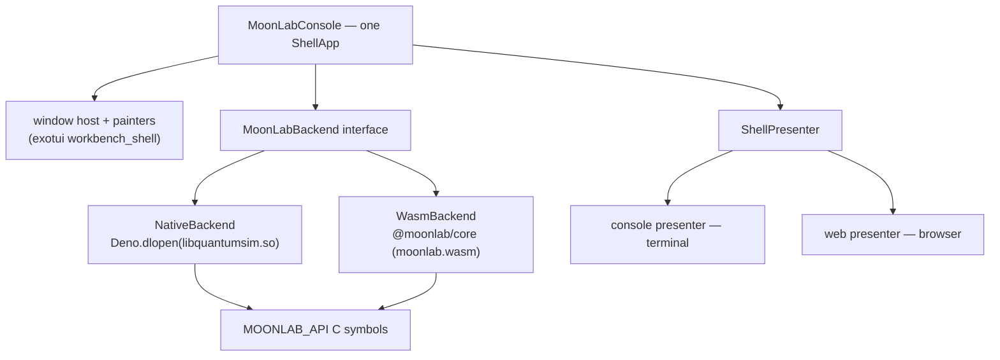

# exomoonlab architecture

A themable terminal-desktop console for MoonLab, built on exotui, running
against the native library in a terminal and against the WASM build in a
browser — from one application, not two.

## The two seams

The design rests on two existing seams. Neither is ours to invent.

**exotui's presenter seam** (`src/app/shell_presenter.ts`) separates a
cell-composed application from whatever shows the cells:

```ts
interface ShellPresenter {
  readonly capabilities: ShellCapabilities;
  size(): ShellPresenterSize;
  onResize(l): () => void;  onKey(l): () => void;
  onPointer(l): () => void; onWheel(l): () => void;
  present(frame: ShellPresentedFrame): void;
  requestFrame(cb: (now: number) => void): void;
  store<T>(name: string): AsyncStore<T>;
  now(): number;  dispose(): void;
}
```

`runShellApp(presenter, app)` is the whole loop. Two presenters ship: the
console one (`src/runtime/console_presenter.ts` — alt screen, diffing ANSI,
SIGWINCH, file stores) and the browser one (`src/web/web_presenter.ts` —
IndexedDB, cells-to-ANSI, the shader layer). exowebtui
(`examples/web/desktop_app.ts`) is the reference application and runs under
both.

**MoonLab's stable C ABI** (ABI 0.7.0, `documents/../STABLE_ABI.md`): every
symbol tagged `MOONLAB_API` is contract, additive within 1.x. The WASM build
re-exports 424 of those symbols through `emscripten/exports.txt`.

So both hosts can reach the *same C functions*. That is the whole reason this
is one application rather than two.

## Where it lives

`bindings/deno/exomoonlab`, beside the JavaScript, Python, and Rust bindings.
The console is a consumer of the ABI, so it is versioned with the ABI: a change
to `exports.txt` and the code that needs it land together, and the equivalence
harness runs against the library built next to it.

## Layering



`MoonLabBackend` is the only new abstraction. It is deliberately narrow: create
and destroy states, apply gates, measure, read amplitudes and probabilities,
run the named algorithms, and report which of those it can actually do.

Both implementations call the same C entry points, so a result computed
natively and the same result computed in WASM must agree bit-for-bit for
integer outputs and within the declared complex64 tolerance for floating
output. That equivalence is a test, not an assumption — see the task file.

## Choosing a backend

At startup, not at build time. The console probes, in order:

1. An explicit `--backend=native|wasm` flag.
2. `Deno.dlopen` availability plus a locatable `libquantumsim.so`/`.dylib`.
3. The WASM module.

The chosen backend and its ABI version are shown in a session window, because
"which backend am I on" is the first question anyone debugging a discrepancy
asks.

## Keeping the frame loop honest

`ShellApp.frame(now, size)` is synchronous and runs every frame. A 20-qubit
state vector or a DMRG sweep cannot run inside it.

Every backend call is therefore asynchronous and off the render thread:

- **Web:** a Web Worker. `bindings/javascript/demo/src/workers/moonlabClient.ts`
  already does exactly this and is the model to follow.
- **Native:** Deno FFI non-blocking symbols, or a worker holding the FFI
  handle.

The application keeps a job table. `frame()` renders whatever each job has
most recently produced — a progress row, a partial histogram, a finished
result — and never waits.

## What we do not change

The MoonLab simulation core is consumed, not reshaped. The one sanctioned
exception is `bindings/javascript/packages/core/emscripten/exports.txt`: when
the console needs a symbol that already exists in C but is not exported to
WASM, adding its line there is a trivial addition to the WASM build. Anything
beyond that — new C functions, changed signatures, altered numerics — is out
of scope and belongs upstream.

## Current state and target state

**Current state.** MoonLab already has a terminal UI: `bindings/rust/moonlab-tui`,
built on Ratatui, with an algorithm browser, step-through, free exploration,
Feynman diagrams, and views for circuits, amplitudes, Bloch spheres, and
entropy. It is Rust, terminal-only, and single-window.

**Target state.** exomoonlab supersedes it as the primary console by being a
windowed, themable desktop that also runs in a browser. `moonlab-tui` stays as
the reference for *what a MoonLab TUI needs to show* — its view list is the
best evidence available of that — and is not deleted or ported mechanically.
